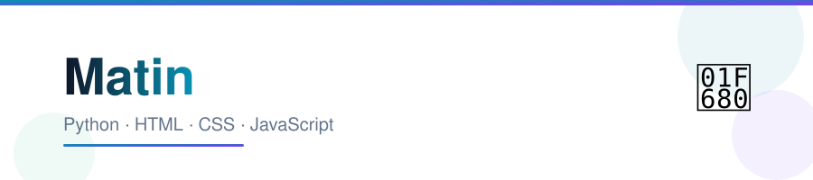
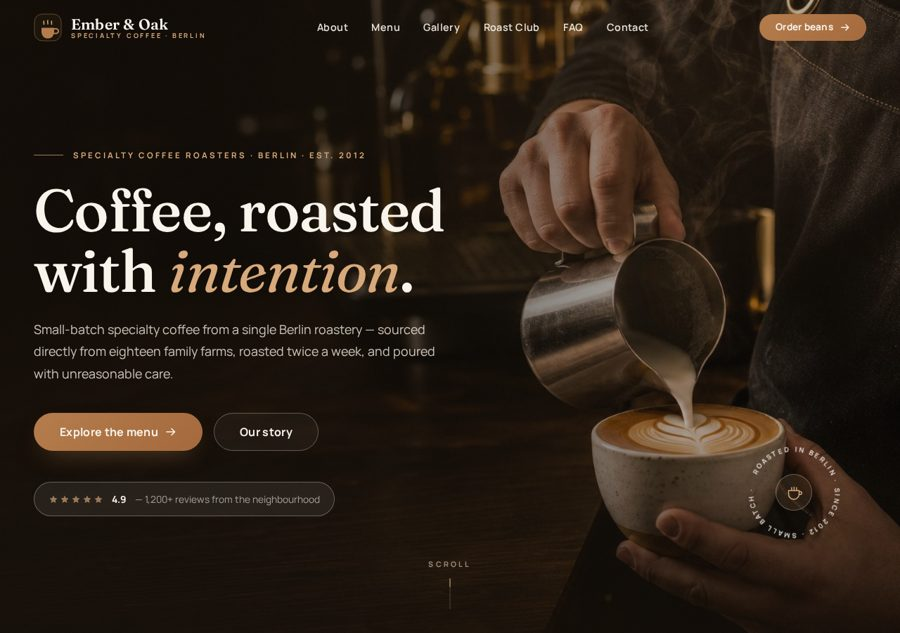
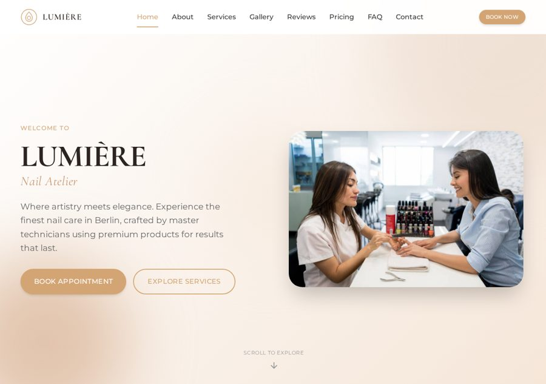
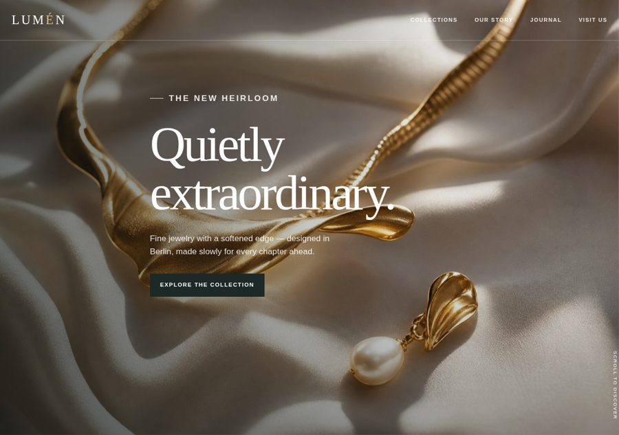
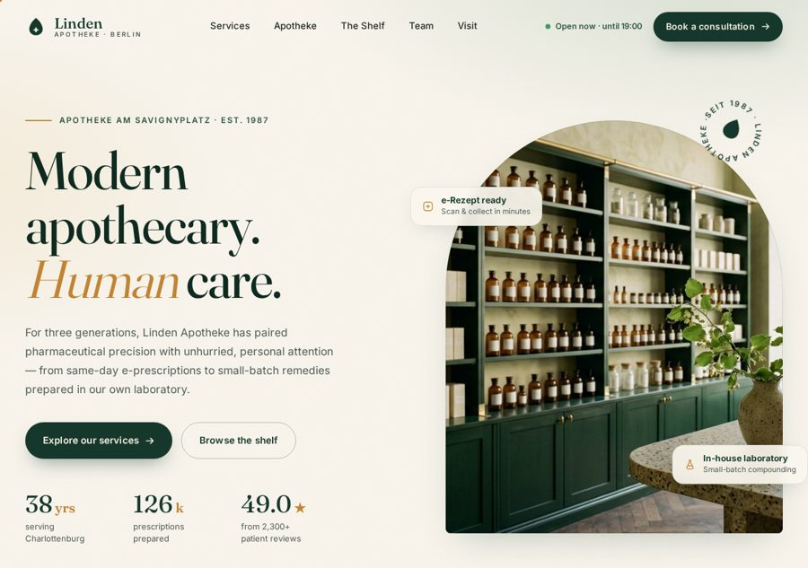
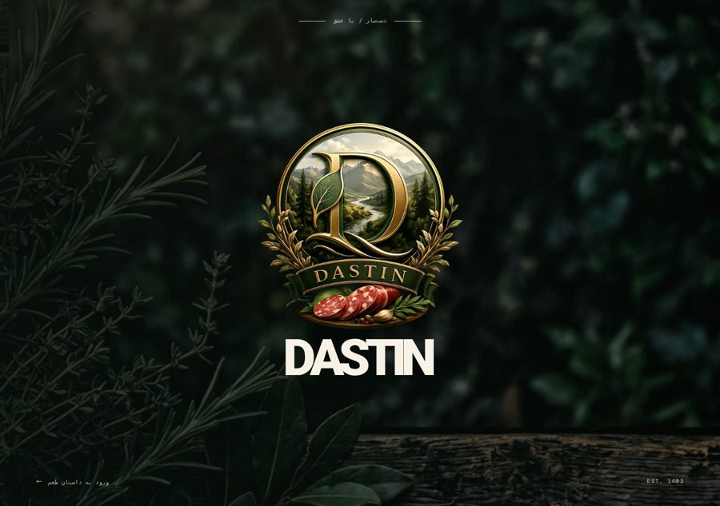
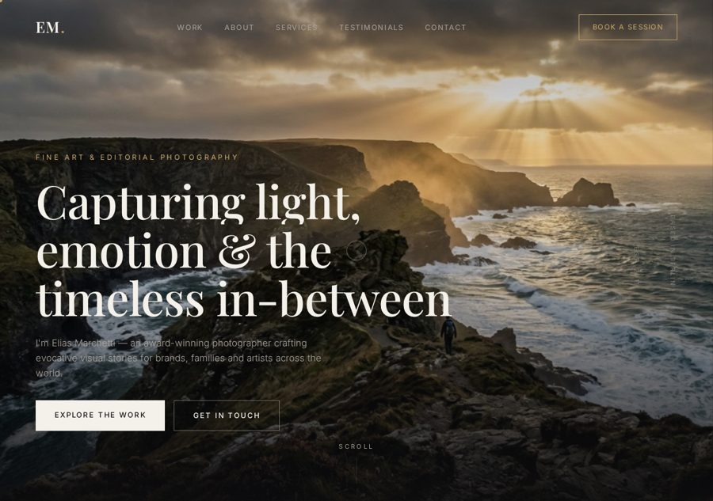

  

  <b>Python intermediate · HTML intermediate · Vibe coder · AI user · High school student</b>

  I like building things that <i>look</i> good and <i>actually work</i>.
  Mostly handcrafted static sites — no frameworks, no build steps, just clean code.
  A few Python apps on the side, mostly desktop tools with real use cases.

---

### 📊 The numbers

---

### 🐍 Contribution snake

  

---

### 📌 Featured work

  
  
  
  
  
  

> Pins are easy to change — just hit **Customize your pins** on my profile.

---

## 🧱 What I build

Mostly **handcrafted static websites** — each one designed from scratch, zero
frameworks, zero dependencies. A lot of them are live on GitHub Pages. Scroll
down, there are screenshots. 👇

### 🏗️ Construction & Real Estate

| Project | What it is |
|---------|-----------|
| [meridian-construction](https://github.com/xvviix/meridian-construction) | Premium construction company site — dark, industrial, built to feel solid |
| [haven-property-rental](https://github.com/xvviix/haven-property-rental) | Property rental platform — curated stays with a luxury booking feel |
| [mehrgan-realestate](https://github.com/xvviix/mehrgan-realestate) | Real estate listing site with a clean, modern layout |
| [aether-architecture](https://github.com/xvviix/aether-architecture) | Architecture studio site — minimal, gallery-first |

### ☕ Food, Coffee & Hospitality

| Project | What it is |
|---------|-----------|
| [ember-oak](https://github.com/xvviix/ember-oak) | Specialty coffee roasters — warm tones, roast-level story |
| [hearth-and-rye](https://github.com/xvviix/hearth-and-rye) | Artisan bakery — rustic, handcrafted feel |
| [sky-route](https://github.com/xvviix/sky-route) | Airline landing page with flight search, dark glassmorphism UI |
| [ferdows-grand-hotel](https://github.com/xvviix/ferdows-grand-hotel) | Grand hotel — elegant, booking-focused |
| [Freshmart](https://github.com/xvviix/Freshmart) | Grocery storefront with a bright, fresh look |

### 💈 Salons, Style & Beauty

| Project | What it is |
|---------|-----------|
| [nail-salon](https://github.com/xvviix/nail-salon) | LUMIÈRE Nail Atelier — soft, premium, elegant |
| [Hair-salon](https://github.com/xvviix/Hair-salon) | Luxury hair salon site |
| [iron-and-velvet](https://github.com/xvviix/iron-and-velvet) | Barbershop — dark + gold, masculine premium |
| [atelier-linnea](https://github.com/xvviix/atelier-linnea) | Design atelier — clean editorial layout |
| [aurelle-ritual-bathing-house](https://github.com/xvviix/aurelle-ritual-bathing-house) | Ritual bathing house — calm, spa-like atmosphere |
| [eila-yoga-studio](https://github.com/xvviix/eila-yoga-studio) | Yoga studio — breathing room, soft gradients |
| [jewelry-store](https://github.com/xvviix/jewelry-store) | LUMEN jewelry — minimal, product-first |
| [Perfume](https://github.com/xvviix/Perfume) | Perfume brand site — sophisticated and moody |
| [Habibi-shoes](https://github.com/xvviix/Habibi-shoes) | Shoe storefront e-commerce layout |
| [zarineh-watch-store](https://github.com/xvviix/zarineh-watch-store) | Watch store — precision, dark luxury |

### 🏥 Health, Wellness & Services

| Project | What it is |
|---------|-----------|
| [sterling-longevity-clinic](https://github.com/xvviix/sterling-longevity-clinic) | Longevity clinic — clean medical + modern |
| [aurea-dental](https://github.com/xvviix/aurea-dental) | Berlin dental clinic — trustworthy, bright |
| [linden-apotheke](https://github.com/xvviix/linden-apotheke) | Pharmacy — handcrafted, professional |
| [kai-lennox](https://github.com/xvviix/kai-lennox) | Elite performance coaching — bold, motivational |
| [fitness-gym](https://github.com/xvviix/fitness-gym) | Apexfit gym — high-energy, dark |

### 🎨 Portfolios & Brands

| Project | What it is |
|---------|-----------|
| [Dastin](https://github.com/xvviix/Dastin) | Brand site — premium look, smooth interactions |
| [photography-portfolio](https://github.com/xvviix/photography-portfolio) | Photographer portfolio — images do the talking |
| [travel-agency](https://github.com/xvviix/travel-agency) | Auora Voyages — wanderlust-driven |
| [ashford-whitmore](https://github.com/xvviix/ashford-whitmore) | Cinematic editorial site for a Berlin law firm |
| [copperline-plumbing](https://github.com/xvviix/copperline-plumbing) | Trade services site — clean and trustworthy |

### 🐍 Python Apps

| Project | What it is |
|---------|-----------|
| [pdf-toolkit-fa](https://github.com/xvviix/pdf-toolkit-fa) | Full PDF utility (Persian UI) — split, merge, convert + **OCR that reads names off scanned docs and names the files for you** |
| [pdf-toolkit-en](https://github.com/xvviix/pdf-toolkit-en) | Same toolkit, English UI |
| [Weather-app](https://github.com/xvviix/Weather-app) | Real-time desktop weather app in Python + Tkinter |
| [rock_paper_scissors](https://github.com/xvviix/rock_paper_scissors) | Classic game, terminal-based |

---

## 🖼️ Some of it, live

A few screenshots from the deployed sites (all on GitHub Pages):

 

 

 

 

> All 28 sites are live — just browse my [repos](https://github.com/xvviix?tab=repositories), almost every one has a working demo link.

---

## 🛠️ Stack

**No frameworks, no build tools.** Every site is vanilla HTML/CSS/JS — it loads fast, deploys in one push, and doesn't break.

---

*Built by hand, one file at a time.*

